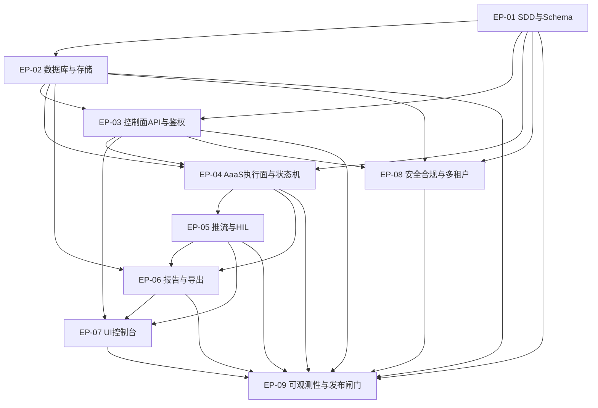

# 执行计划索引（Plan）

本目录用于把 `docs/` 中的需求与设计转化为可执行的研发计划（多个 Plan），并贯彻 Harness Engineering + TDD。

## 全局开发约束（必须）

- **Harness Engineering**：先建护栏（Schema/契约/回放/基准），再写实现
- **TDD**：关键路径以测试驱动实现（先写失败测试，再写最小实现，再重构）
- **SDD**：跨模块对象先定义 Schema（带版本），再实现 API/DB/推流/导出
- **SaaS 多租户**：所有数据访问必须租户隔离，提供跨租户负向测试
- **安全**：不得记录/输出 token、密码、API Key；截图/录屏按租户加密与受控访问
- **UI**：全屏无滚动条，超量信息必须分页/折叠/抽屉；长 JSON 截断 + 复制全文
- **SOLID + 迪米特**：单一职责、开闭、里氏、接口隔离、依赖倒置、最少知识原则
- **中文注释**：关键业务逻辑/安全边界/HIL 分支/状态机路由必须包含中文注释说明意图与风险

## 计划列表

| 计划 | 优先级 | 描述 |
|------|--------|------|
| [01_SDD与Schema计划](./01_SDD与Schema计划.md) | P0 | 定义核心数据契约、Schema版本化与校验机制，是所有模块的基础 |
| [02_数据库与存储计划](./02_数据库与存储计划.md) | P0 | 核心表结构设计、索引优化、租户隔离存储层 |
| [03_控制面API与鉴权计划](./03_控制面API与鉴权计划.md) | P0 | RESTful API、RBAC权限模型、JWT认证与多租户上下文 |
| [04_AaaS执行面与状态机计划](./04_AaaS执行面与状态机计划.md) | P1 | Worker执行引擎、任务状态机、重试与容错机制 |
| [05_推流与HIL计划](./05_推流与HIL计划.md) | P1 | WebSocket实时推流、人机介入工单系统、操作接管机制 |
| [06_报告与导出计划](./06_报告与导出计划.md) | P1 | 执行报告生成、多格式导出(PDF/Excel/JSON)、历史存档 |
| [07_UI控制台计划（全屏无滚动）](./07_UI控制台计划（全屏无滚动）.md) | P1 | 前端控制台、全屏布局、分页/折叠/抽屉组件 |
| [08_安全合规与多租户验证计划](./08_安全合规与多租户验证计划.md) | P0 | 安全审计、合规验证、租户隔离测试、敏感数据处理 |
| [09_可观测性与发布闸门计划](./09_可观测性与发布闸门计划.md) | P1 | 日志/指标/链路追踪、健康检查、发布准入闸门 |

## 迭代建议

### 迭代 0 (Week 1): 基础设施
- EP-01 全部完成 (Schema 定义与校验)
- EP-02 FE-02-01 (核心表与索引)

### 迭代 1 (Week 2-3): 控制面核心
- EP-03 全部完成 (鉴权/RBAC/API)
- EP-02 FE-02-02, FE-02-03 (存储与队列)

### 迭代 2 (Week 4-5): 执行面闭环
- EP-04 FE-04-01, FE-04-02 (Worker + 状态机)
- EP-05 FE-05-01 (WebSocket 推流)

### 迭代 3 (Week 6-7): HIL 与报告
- EP-05 FE-05-02, FE-05-03 (HIL 工单与接管)
- EP-06 全部完成 (报告生成与导出)

### 迭代 4 (Week 8-9): UI 与安全
- EP-07 全部完成 (前端控制台)
- EP-08 全部完成 (安全合规验证)

### 迭代 5 (Week 10): 可观测性与发布
- EP-09 全部完成 (可观测性与闸门)
- 集成测试与回归验证

## 依赖关系图

## 可并行计划说明

- **EP-01 是所有计划的起点**，必须最先完成（定义 Schema 契约）
- **EP-02 和 EP-03 可并行开发**：在 EP-01 完成后，数据库层与 API 鉴权层可独立推进
- **EP-04 需要等待 EP-01, EP-02, EP-03 完成**：执行面依赖 Schema、存储和鉴权
- **EP-08 安全验证贯穿所有迭代**：每个迭代完成后需同步进行安全合规检查
- **EP-09 是最终验收**：依赖所有计划完成，作为发布前的最后一道闸门

