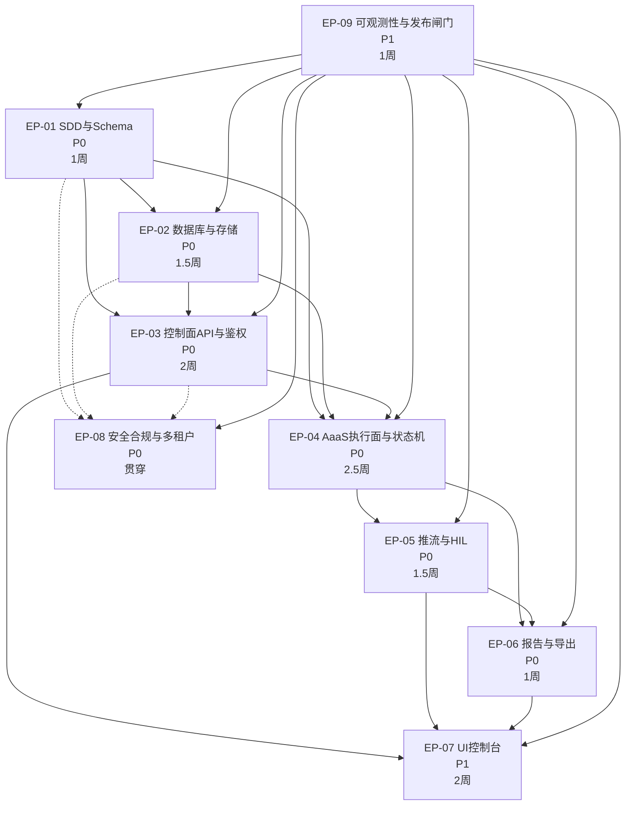

# 依赖关系可视化

## 1. Mermaid 依赖关系图

## 2. 关键路径说明

- **路径 1 (数据层)**: EP-01 → EP-02 → EP-03
- **路径 2 (执行层)**: EP-01 → EP-04 → EP-05 → EP-06
- **路径 3 (UI层)**: EP-03 → EP-07
- **路径 4 (验收层)**: EP-09 依赖所有计划

## 3. 并行开发机会

- EP-02 与 EP-03 可在 EP-01 完成后并行
- EP-05 与 EP-06 可在 EP-04 完成后并行
- EP-07 与 EP-08 可在各自前置完成后并行

## 4. 风险点

- EP-01 延迟将阻塞所有后续计划
- EP-04 是核心执行能力，风险最高
- EP-08 贯穿全程，需持续关注
